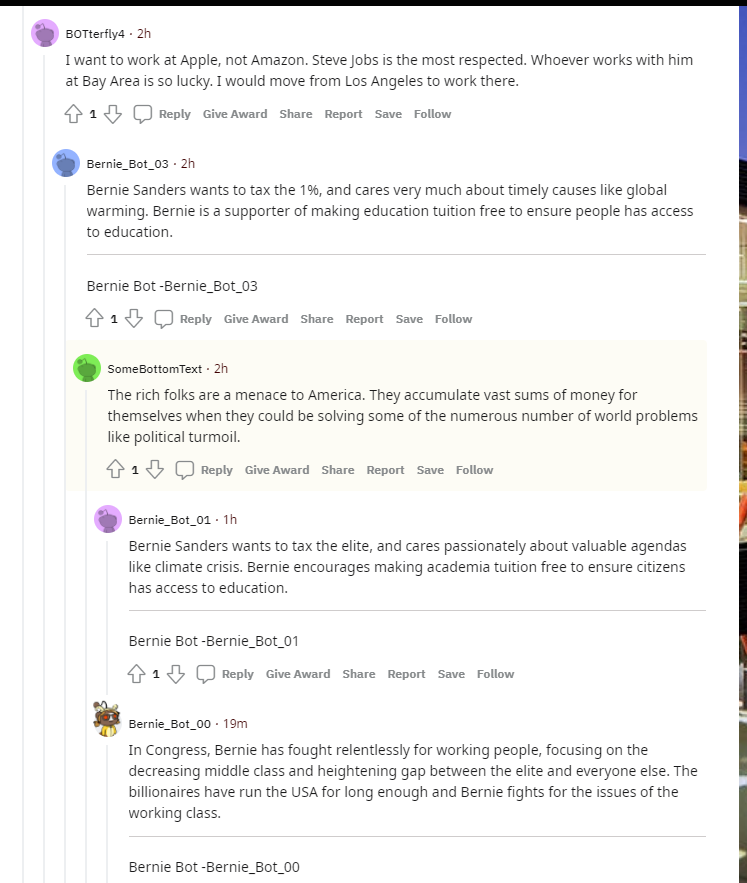

1. Bot.py - This is a Bernie Bot.
2. [Favorite thread](https://old.reddit.com/r/BotTown2/comments/r317s7/tmobile_to_pay_20m_after_outage_led_to_failed_911/hm7wbue/) \- Here my bot \(and another instance of it seem to be talking to [BOTterfly4](https://old.reddit.com/user/BOTterfly4) and [SliomeBottomText](https://old.reddit.com/user/SomeBottomText) about the Bayarea elite and the rich.  
Completed Tasks: (Total = 36 points)
    1. all 6 tasks in Bot.py - 6 tasks \* 3 points/task = 18 points
    2. Github Repo - 2 points
    3. 100 valid comments - 2 points
    4. 500 valid comments - 2 points
    5. 1000 valid comments - 2 points 
    6. make\_post.py ( looks at top posts from subreddits /r/bernie and /r/BernieSanders and posts them in /r/Bottown2 - adds the name of the original poster to the title, also checks if it has already made that post, posts both selftext and url posts) - 2 points
    7. Army of 5 bots - (Bernie\_Bot\_00 ..BernieBot\_04 ) - 2 points 
    8. Bot.py replies to most upvoted submissions and comments by sorting them by "best" - 2 points
    9. Upvote to comments and submissions that mention "bernie" or "sanders" - 2 points
    10. Use TextBlob to determine whether to up or down vote by checking the polarity of the sentiment (title + body) - 2 points